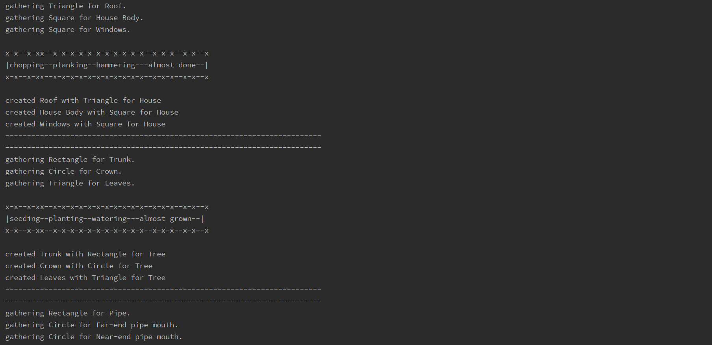
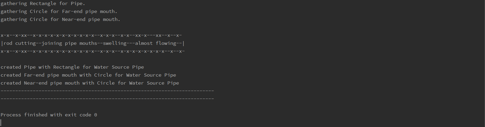
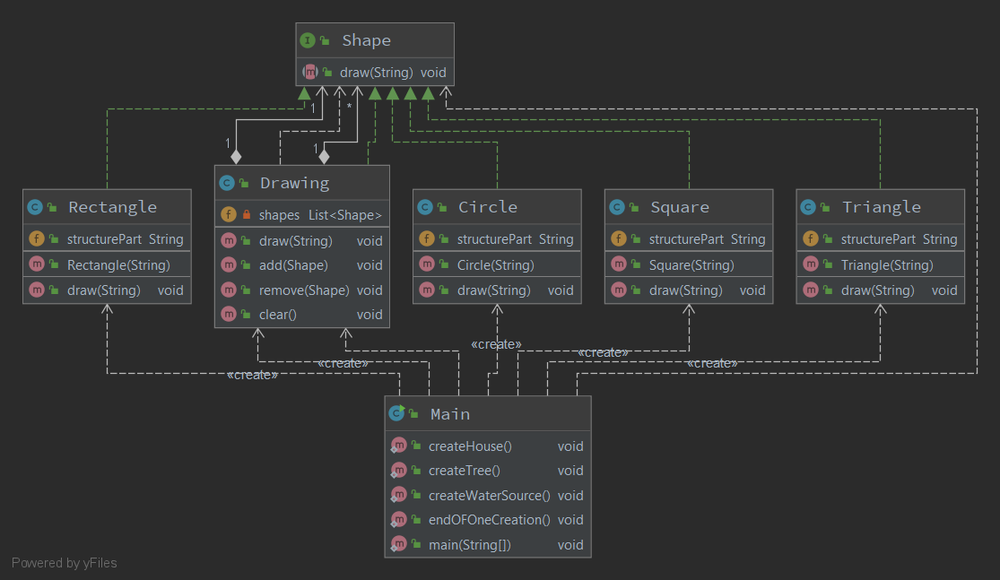

# CSE-4851-Composite-Pattern-Assignment
Creating the house, tree or water sources by adding different types of simple shapes using Composite Pattern.

# Explanation
When we need to create a structure in a way that the objects in the structure has to be treated the same way, we can apply composite design pattern. I have the class **Shape**. It has one member method **draw()**.
A composite shape is made up off different basic shapes. In this project, the basic shapes are **Square**, **Triangle**, and **Circle**. Composite shapes are **House** (made up of basic shapes **Square** and **Triangle**), **Tree** (made from **Rectangle**, **Circle** and **Triangle**), and **WaterSource** (made from **Circle** and **Rectangle**). 

*Main.java* file has the main driver code. It will create basic structures with somple shapes. For the sake of simplicity, I've used each structures once. While creating a particular structure, first respective functions are called from **main()** method. This called function will gather the necessary shapes into an array list, which will eventually create the structures.

Snippets shows the output of the *Main.java* file:

UML diagram of this pattern:

